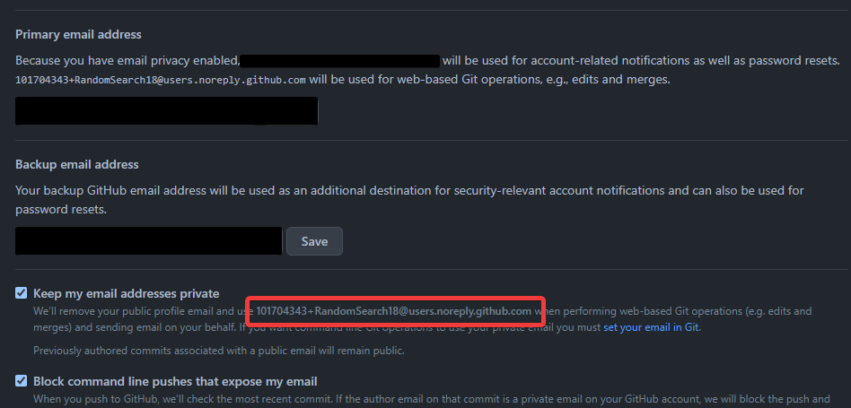

# Set up PortableGit

[Git](https://git-scm.com/) is a popular version control program. It works in conjunction with Github,
which provides a central platform for storing and sharing Git repositories. PortableGit is a distribution
of Git that can run self-contained on a thumb drive (or any other storage device), making it usable on
school computers.

## Step 1: Download the PortableGit installer and install it onto your thumb drive

1. Visit the [Git downloads page for Windows](https://git-scm.com/download/win) and download **64-bit Git for Windows Portable**

    - As the installer is a `.exe` file, you won't be able to save it to your home folder

2. Run the installer and provide it with the path to a folder on your thumb drive, e.g. `E:\Programs\Git`
3. The installer will spend some time extracting the files, and then automatically exit as soon as it's done

## Step 2: Understand the contents of your PortableGit installation folder

The most important files in the PortableGit installation folder are:

- `bin/git.exe` - This is the Git program itself, a command-line tool that you can use manually in PowerShell or another terminal
- `git-bash.exe` - This program runs Git Bash in a terminal window. Git Bash is a terminal environment that works like a Bash shell on Linux and provides easy access to `git` commands

## Step 3: Configure Git to work on the school network

By default, Git won't accept the self-signed certificate that the school uses on its network. To solve this, follow the [guide on fixing SSL cetificate errors from Git](./disable-ssl.md).

## Step 4: Set your username and email in Git

Git needs to know who you are so that it can mark you as the author of any commits you make. Specifically, you need to set the `user.name` and `user.email` configuration options in Git.

The name should match your GitHub username, and the email address should be one of yours. Since this information is publicly available on any repository you contribute to, it's best to use a email address provided by GitHub to keep your real email address private.

### Find your GitHub-provided email address

Visit the your [email settings on GitHub](https://github.com/settings/emails#toggle_visibility_note) and look for your assigned email address ending in `@users.noreply.github.com` (see image below)



### Configure user name and email options

Run these commands in Git Bash, replacing `MyUserName` and `MyEmail@users.noreply.github.com` with your username and email address, as mentioned above.

```bash
git config --global user.name "MyUserName"
git config --global user.email "MyEmail@users.noreply.github.com"
```

You can paste into Git Bash with <kbd>Shift</kbd>+<kbd>Insert</kbd> or from the right-click menu.

## Further reading

- [Setting your username in Git - GitHub Docs](https://docs.github.com/en/get-started/getting-started-with-git/setting-your-username-in-git)
- [Setting your commit email address - GitHub Docs](https://docs.github.com/en/account-and-profile/setting-up-and-managing-your-personal-account-on-github/managing-email-preferences/setting-your-commit-email-address#setting-your-commit-email-address-in-git)
