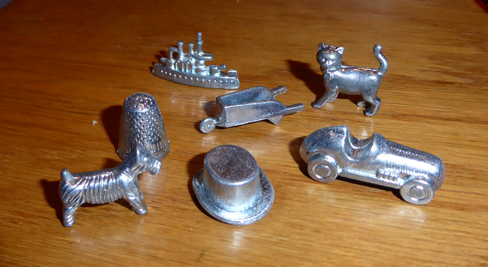

# Monopoly resources

## Reference documents

### Gameplay and mechanics

- [Monopoly/Official Rules (Wikibooks)](https://en.wikibooks.org/wiki/Monopoly/Official_Rules) - Provides information on how the game logic should be implemented
- [Monopoly rules booklet (PDF, 4.6 MB)](./monopoly-rules-booklet.pdf) - A scanned copy of the rules booklet that came with my copy of the game (cira 2013)

### Board and card design

- [Photo of the British Monopoly board (monopolyland.com)](https://www.monopolyland.com/wp-content/uploads/Uk-Monopoly-board-1-1.jpg) - Shows the board design and colors used
- [Photo of a selection of title deed cards (eBay)](https://i.ebayimg.com/images/g/-RMAAOSw7i1i4tLY/s-l1600.jpg) - Shows the design of the street title deed, utility, and station cards. Note that the street names are from the American edition.

### Lists

- [List of London *Monopoly* locations (Wikipedia)](https://en.wikipedia.org/wiki/List_of_London_Monopoly_locations) - Lists the properties in the British edition of the game, including their colors and prices

### Tokens

My copy of Monopoly (dated 2013 on the copyright notice) came with 7 pieces:

- Battleship
- Thimble
- Wheelbarrow
- Cat
- Dog
- Race Car
- Top Hat

